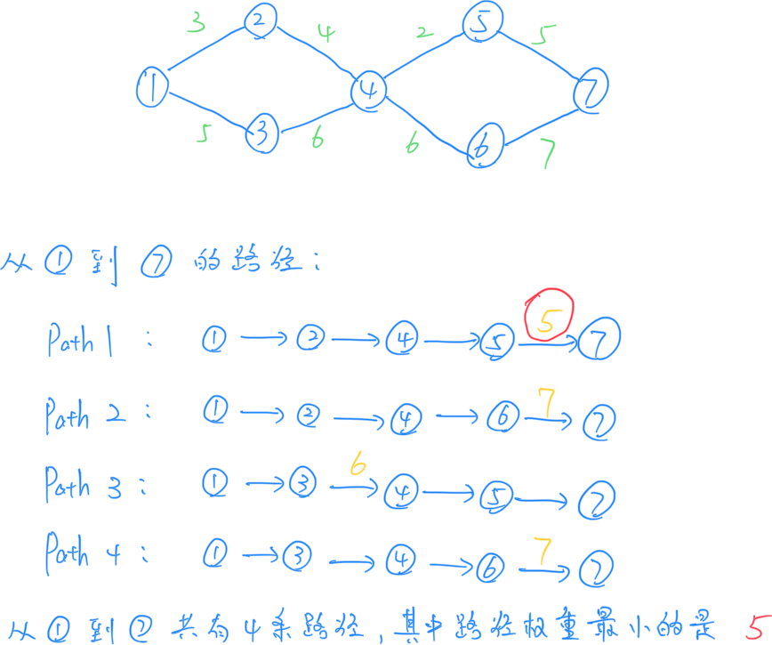
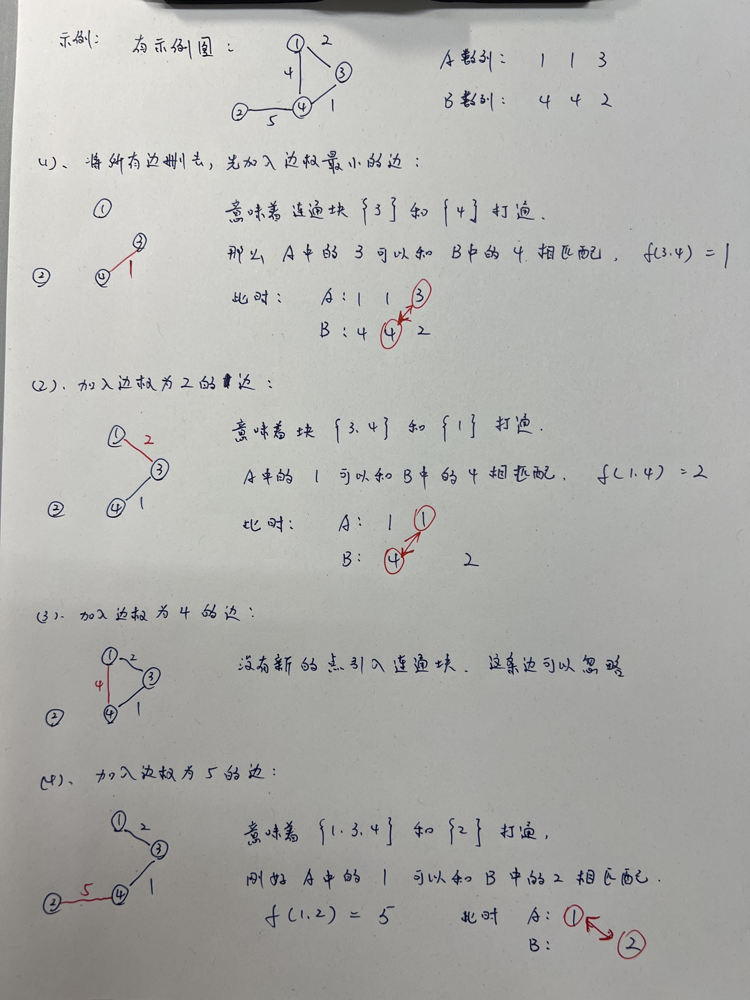

# **A - Humidifier 1**

Problem：[A - Humidifier 1](https://atcoder.jp/contests/abc383/tasks/abc383_a)

模拟题。非常的简单。

```c++
// Problem:

#include <bits/stdc++.h>
using namespace std;
typedef long long LL;
typedef pair<int, int> PII;

void solve() {
    int n;
    cin >> n;

    int res = 0, last_t = 0;
    for (int i = 1; i <= n; i++) {
        int t, v;
        cin >> t >> v;

        if (res)
            res = max(res - (t - last_t), 0);
        res += v;
        last_t = t;
    }

    cout << res << endl;
}

int main() {
    cin.tie(0);
    ios_base::sync_with_stdio(false);
    solve();
    return 0;
}
```


# **B - Humidifier 2**

Problem：[B - Humidifier 2](https://atcoder.jp/contests/abc383/tasks/abc383_b)

暴力搜索。

由于数据范围非常小，网格最大也才 $10\times 10$，所以直接暴力枚举两个加湿器的位置，然后暴力计算每个点和加湿器的位置即可。

```c++
// Problem: https://atcoder.jp/contests/abc383/tasks/abc383_b

#include <bits/stdc++.h>
using namespace std;
typedef long long LL;
typedef pair<int, int> PII;

const int N = 15;
char g[N][N];
bool st[N][N];
int res;
int h, w, d;

int check(int a, int b, int x, int y) {
    int ans = 0;
    for (int i = 0; i < h; i++)
        for (int j = 0; j < w; j++)
            if (g[i][j] == '.')
                if (abs(i - a) + abs(j - b) <= d ||
                    abs(i - x) + abs(j - y) <= d) {
                    ans++;
                }

    return ans;
}

void solve() {
    cin >> h >> w >> d;
    for (int i = 0; i < h; i++)
        for (int j = 0; j < w; j++)
            cin >> g[i][j];

    // 确定第一台的位置
    for (int i = 0; i < h; i++)
        for (int j = 0; j < w; j++) {
            // 确定第二台的位置
            for (int x = 0; x < h; x++)
                for (int y = 0; y < w; y++) {
                    // 如果是同一个点，跳过
                    if (i == x && j == y)
                        continue;
                    // 如果两个点都是 地板
                    if (g[i][j] == '.' && g[x][y] == '.') {
                        res = max(res, check(i, j, x, y));
                    }
                }
        }
    cout << res << endl;
}

int main() {
    cin.tie(0);
    ios_base::sync_with_stdio(false);
    solve();
    return 0;
}
```


# **C - Humidifier 3**

Problem：[C - Humidifier 3](https://atcoder.jp/contests/abc383/tasks/abc383_c)

图论题目。

题目本质是在问每个格子到最近的 $H$ 距离是多少。使用经典的 “虚拟节点” 方法转换为单源最短路问题。我的答案里把 `1e6+5` 作为了虚拟节点。

```c++
// Problem: https://atcoder.jp/contests/abc383/tasks/abc383_c

#include <bits/stdc++.h>
using namespace std;
typedef long long LL;
typedef pair<int, int> PII;

const int N = 1e6 + 10, M = 20 * N;
int h[N], e[M], w[M], ne[M], idx;
int dist[N];
int st[N];

int H, W, d;
char g[1010][1010];
int dx[4] = {-1, 0, 1, 0}, dy[4] = {0, 1, 0, -1};

void add(int a, int b, int c) {
    e[idx] = b;
    w[idx] = c;
    ne[idx] = h[a];
    h[a] = idx++;
}

// SPFA 算法
void spfa() {
    int start = 1e6 + 5;
    memset(dist, 0x3f, sizeof dist);
    dist[start] = 0;
    queue<int> q;
    q.push(start);
    st[start] = true;

    while (q.size()) {
        int now = q.front();
        q.pop();
        st[now] = false;

        for (int i = h[now]; i != -1; i = ne[i]) {
            int next = e[i];
            if (dist[next] > dist[now] + w[i]) {
                dist[next] = dist[now] + w[i];
                if (!st[next]) {
                    q.push(next);
                    st[next] = true;
                }
            }
        }
    }
}

void solve() {
    // 读入网格数据
    cin >> H >> W >> d;
    for (int i = 0; i < H; i++)
        for (int j = 0; j < W; j++)
            cin >> g[i][j];

    // 建图
    memset(h, -1, sizeof h);
    for (int i = 0; i < H; i++)
        for (int j = 0; j < W; j++) {
            // ‘#’点不建图
            if (g[i][j] == '#')
                continue;
            int now = i * W + j;
            // ‘H’点额外添加和虚拟节点 1e6+5 的 0 边权的边
            if (g[i][j] == 'H') {
                add(1e6 + 5, now, 0), add(now, 1e6 + 5, 0);
            }
            // 看一下周围四个点能不能建边
            for (int k = 0; k < 4; k++) {
                int a = i + dx[k], b = j + dy[k];
                // 越界
                if (a < 0 || a >= H || b < 0 || b >= W)
                    continue;
                // 遇到 #
                if (g[a][b] == '#')
                    continue;
                // 建边
                add(now, a * W + b, 1);
            }
        }

    spfa();

    // 遍历，看距离 H 在 d 以内的点有多少
    int res = 0;
    for (int i = 0; i < H; i++)
        for (int j = 0; j < W; j++)
            if (g[i][j] != '#' && dist[i * W + j] <= d)
                res++;

    cout << res << endl;
}

int main() {
    cin.tie(0);
    ios_base::sync_with_stdio(false);
    solve();
    return 0;
}
```


# **D - 9 Divisors**

Problem：[D - 9 Divisors](https://atcoder.jp/contests/abc383/tasks/abc383_d)

数论题目。

能满足只有 9 个约数的数字实际上不多。

> 约数基本定理：
>
> ​	一个数能被拆成若干个质数乘积的形式 $N=P_{1}^{a_1}P_{2}^{a_2}\dots P_{k}^{a_k}$，那么 N 的约数个数为 $(a_1+1)(a_2+1)\dots (a_k+1)$。

按照上面定理的格式，9 只能被拆分为 $1\times9$ 或者 $3\times 3$ 两种可能性。

- $1\times9$ ：表明数字 $N = P^8$，是某一个质数的 8 次方
- $3\times 3$ ：表示数字 $N = P_i^2 \times P_j^2$，是某两个质数的平方和

思路：

​	预处理出来质数表。分成两种情况遍历即可。这道题也并不需要真的预处理出来 $4\times 10^{12}$ 这么多数字，只需要计算到 $\sqrt{4\times 10^{12}} = 2 \times 10^6$ 即可。 

```c++
// Problem: https://atcoder.jp/contests/abc383/tasks/abc383_d

#include <bits/stdc++.h>
using namespace std;
typedef long long LL;
typedef pair<int, int> PII;

const LL N = 2e6 + 10;
LL primes[N], cnt;
bool st[N];
LL n;

// 线性筛法模板
void get_primes(LL x) {
    for (LL i = 2; i <= x; i++) {
        if (!st[i])
            primes[cnt++] = i;
        for (LL j = 0; primes[j] * i <= x; j++) {
            st[i * primes[j]] = true;
            if (i % primes[j] == 0)
                break;
        }
    }
}

// 计算 x^4 的值
LL pow_4(LL x) {
    return x * x * x * x;
}

void solve() {
    // 读入数据，计算平方根
    cin >> n;
    LL intSqrt = sqrt(n) + 1;

    // 预处理质数表
    get_primes(intSqrt);

    // 讨论 1*8 的情况
    int res = 0;
    for (int i = 0; i < cnt; i++) {
        if (pow_4(primes[i]) < intSqrt)
            res++;
        // 防止溢出，超出界限直接 break，后面的再不算了
        else
            break;
    }

    // 讨论 3*3 的情况
    for (int i = 0; i < cnt; i++)
        for (int j = i + 1; j < cnt; j++) {
            LL temp = primes[i] * primes[j];
            if (temp < intSqrt)
                res++;
            // 防止溢出，超出界限直接 break
            else
                break;
        }

    cout << res << endl;
}

int main() {
    cin.tie(0);
    ios_base::sync_with_stdio(false);
    solve();
    return 0;
}
```

# E - Sum of Max Matching

Problem：[E - Sum of Max Matching](https://atcoder.jp/contests/abc383/tasks/abc383_e)

## 题目：

给定一个$N$ 节点 $M$ 条边，带正边权的简单无向图。对于从 $x$ 到 $y$ 的一条路径，路径权重为该路径经过的所有边的最大值。令 $f(x,y)$ 是从 $x$ 走到 $y$ 的所有路径的路径权重的最小值。

给定两个长度为 $K$ 的序列 $A$ 和 $B$，$B$ 可以自由排序，求 $\displaystyle \sum_{i=1}^{K} f(A_i, B_i)$ 的最小值。

## 关键数据范围：

$2 \leq N \leq 2 \times 10^5$ 

$N-1 \leq M \leq \min(\frac{N \times (N-1)}{2},2 \times 10^5)$ 

$1 \leq K \leq N$

$1 \leq u_i<v_i \leq N$ $(1 \leq i \leq M)$ 

$1 \leq w_i \leq 10^9$

$1 \leq A_i,B_i \leq N$ $(1 \leq i \leq K)$

The given graph is simple and connected.

All input values are integers.

## 思路：

这道题非常类似于 NOPI2013提高组的题目：[506. 货车运输 - AcWing题库](https://www.acwing.com/problem/content/description/508/)

题目解析：$f(x,y)$ 表示从 $x$ 走到 $y$ 的所有路径中，最小的路径权重。例如：



如上述例子，有 $f(1,7) = 5$。

**直觉思路：二分**

对于求类似 “最大值的最小值” 类型的题目，基本都可以使用二分思路来解决。

对于一个 $mid$ 值，将图中所有边权大于 $mid$ 的边全部删掉，看剩下的图的连通性。

**本题思路：并查集+贪心**

如果我们将所有的边按照边权升序排列，一条边一条边的添加进图。我们希望 $f$ 的值尽可能的小，意味着需要 A 和 B 中的点尽可能早的进行匹配。那么每次加入一条边，就有可能会合并两个连通块，那么新加入的这条边的边权，一定是两个连通块之间 $f$ 值的最小值。如果匹配成功了 $x$ 对，那么就会产生 $xw$ 的 $f$ 值。

详细可参考下面的示例：



备注：最后实际上生成的图是“最小生成树”，算法类似于 Kruskal 算法。

```c++
// Problem: https://atcoder.jp/contests/abc383/tasks/abc383_e

// 并查集 + 贪心
#include <bits/stdc++.h>
using namespace std;
typedef long long LL;
typedef pair<int, int> PII;

const int N = 2e5 + 10;

struct Edge {
    int w;
    int u, v;
} e[N];

bool cmp(Edge& a, Edge& b) {
    return a.w < b.w ? true : false;
}

int A[N], B[N];
int cnta[N], cntb[N];  // 连通块中，未匹配的A和B各个元素的数目
int p[N];              // 并查集数组，存储每个元素的祖宗元素
int n, m, k;

// 找到 x 的祖宗节点
int find(int x) {
    if (p[x] != x)
        p[x] = find(p[x]);
    return p[x];
}

// 计算x和y点相连，能匹配成功多少对点
int merge(int x, int y) {
    // 求 x 和 y 的根节点
    int px = find(x), py = find(y);
    // 如果相同，说明他们已经在一个连通块了，不能再匹配了
    if (px == py)
        return 0;
    // 把 x 并入 y 中
    p[px] = py;
    // 将 px 连通块的 AB 计数加到 py 上
    cnta[py] += cnta[px];
    cntb[py] += cntb[px];

    // 合并完成后，看看在 fy 为根的连通块中有多少对可以A与B相匹配
    int tmp = min(cnta[py], cntb[py]);

    // 匹配完成，把匹配掉的A和B减掉。（因为已经成对了，不是未匹配的状态）
    cnta[py] -= tmp;
    cntb[py] -= tmp;

    // 返回这一次匹配成功了多少个点
    return tmp;
}

void solve() {
    cin >> n >> m >> k;
    // 读入所有的边
    for (int i = 0; i < m; i++) {
        int a, b, c;
        cin >> a >> b >> c;
        e[i] = {c, a, b};
    }
    // 储存 A 和 B
    for (int i = 0; i < k; i++)
        cin >> A[i];
    for (int i = 0; i < k; i++)
        cin >> B[i];
    // 并查集初始化
    for (int i = 1; i <= n; i++)
        p[i] = i;
    // 按照边权升序排列
    sort(e, e + m, cmp);

    // 预处理A和B中，每个元素的数量，存在cnta和cntb中
    for (int i = 0; i < k; i++) {
        cnta[A[i]]++;
        cntb[B[i]]++;
    }

    // 遍历每一条边
    LL res = 0;
    for (int i = 0; i < m; i++) {
        // 看加入i边后，能匹配多少对
        res += merge(e[i].u, e[i].v) * e[i].w;
    }

    // 输出结果
    cout << res << endl;
}

int main() {
    cin.tie(0);
    ios_base::sync_with_stdio(false);
    solve();
    return 0;
}
```

# **F - Diversity**

Problem：[F - Diversity](https://atcoder.jp/contests/abc383/tasks/abc383_f)

